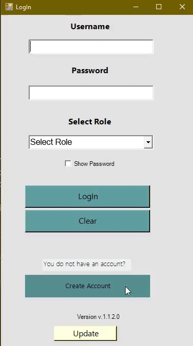

# 🛒 Supermarket Manager

A supermarket management system. Originally built as a **Windows Forms / .NET 4.8** desktop application, ported to **ASP.NET Core Blazor Server (.NET 10)** to run natively on macOS, Windows, and Linux.

---

## Tech Stack

| Layer | Technology |
|-------|-----------|
| UI | Blazor Server (.NET 10) |
| Backend | ASP.NET Core + C# |
| Data Access | Custom ORM via Reflection (DataModel, DataContext) |
| Database | Microsoft SQL Server 2022 (via Docker) |
| Password Hashing | BCrypt.Net-Next |
| Excel Import/Export | EPPlus |

---

## Features

### User Roles

| Role | Access |
|------|--------|
| **SuperAdmin** | Full access + database administration |
| **Admin** | Products, categories, sellers, bills |
| **Seller** | View products, create bills |

### Pages

- **Dashboard** — Live stats: products, categories, sellers, today's revenue, low-stock alerts
- **Products** — CRUD, search, low-stock badge (≤ 5 units)
- **Categories** — CRUD
- **Sellers** — CRUD, password change
- **Bills** — List with date filters, details view, delete
- **Create Bill** — Product picker, quantities, automatic stock update
- **Database Admin** *(SuperAdmin only)* — Backup, restore, clean tables

---

## Prerequisites

- **Docker Desktop** — [download](https://www.docker.com/products/docker-desktop/) — runs SQL Server
- **.NET 10 SDK** — install via Homebrew on macOS: `brew install dotnet`

---

## Getting Started

### 1. Clone

```bash
git clone https://github.com/Taskoudis-Dimi/Supermarket.git
cd Supermarket/SupermarketWeb
```

### 2. Build

```bash
./build.sh
```

### 3. Run

```bash
./start.sh
```

Open **http://localhost:5000** in your browser.

### Default credentials

| Username | Password | Role |
|----------|----------|------|
| `admin` | `admin123` | SuperAdmin |

---

## Scripts

| Script | Description |
|--------|-------------|
| `./build.sh` | Compiles the application |
| `./start.sh` | Starts SQL Server (Docker) + Blazor app |

Stop the app with `Ctrl+C`.

---

## Project Structure

```
Supermarket/
├── SupermarketWeb/              # Blazor Server (.NET 10) — cross-platform
│   ├── SupermarketWeb/          # Web application
│   │   ├── Components/
│   │   │   ├── Layout/          # MainLayout, NavMenu
│   │   │   └── Pages/           # Login, Home, Products, Categories,
│   │   │                        # Sellers, Bills, CreateBill, DatabaseAdmin
│   │   ├── wwwroot/app.css      # Custom CSS
│   │   ├── appsettings.json     # Connection string
│   │   └── Program.cs           # App startup & DI
│   ├── SupermarketWeb.Data/     # Data layer
│   │   ├── DataContext.cs       # SQL Server connection (singleton)
│   │   ├── DataModel.cs         # Generic CRUD via Reflection
│   │   ├── Attributes.cs        # [TableName], [PrimaryKey], [Encrypted]...
│   │   ├── Utils.cs             # BCrypt, logging, type helpers
│   │   ├── Models/              # Admins, ProductTbl, CategoryTbl,
│   │   │                        # BillTbl, SellersTbl
│   │   └── Services/            # AuthService, ProductService,
│   │                            # CategoryService, BillService, SellerService
│   ├── docker-compose.yml       # SQL Server 2022 container
│   ├── init-db.sql              # Schema + seed data
│   ├── start.sh                 # Startup script
│   └── build.sh                 # Build script
│
├── SupermarketTuto/             # Original Windows Forms app (legacy)
├── DataClass/                   # Original data layer (legacy, .NET 4.8)
├── Server/                      # TCP/UDP Server (legacy)
├── Service/                     # Windows Service (legacy)
├── CallSuperMarketAPI/          # External API client (legacy)
├── smarket.sql                  # Original SQL schema
└── backupfile.bak               # Database backup
```

---

## Development

### Connection string

Located in `SupermarketWeb/SupermarketWeb/appsettings.json`:

```json
{
  "ConnectionStrings": {
    "smarketdb": "Server=localhost,1433;Database=smarket;User ID=sa;Password=Smarket@2024!;TrustServerCertificate=True;Encrypt=False;"
  }
}
```

> For production use environment variables or a secrets manager instead of plaintext credentials.

### Manage SQL Server

```bash
docker compose up -d      # Start
docker compose down       # Stop
docker compose logs -f    # View logs
```

### Reset the database

```bash
docker exec -i supermarket-sqlserver /opt/mssql-tools18/bin/sqlcmd \
  -S localhost -U sa -P 'Smarket@2024!' -C \
  -i init-db.sql
```

### Hot reload (development)

```bash
export DOTNET_ROOT="/opt/homebrew/opt/dotnet/libexec"
export PATH="$DOTNET_ROOT:$PATH"
dotnet watch --project SupermarketWeb/SupermarketWeb.csproj \
             --urls "http://localhost:5000"
```

---

## Data Layer

`SupermarketWeb.Data` implements a lightweight ORM using Reflection and custom attributes:

```csharp
// Model definition
[TableName("ProductTbl")]
public class ProductTbl
{
    [PrimaryKey]     public int ProdId { get; set; }
    [FieldSize(200)] public string ProdName { get; set; }
    [Encrypted]      public string Password { get; set; }  // BCrypt hash
}

// Usage
var products = DataModel.Select<ProductTbl>(where: "ProdQty > 0", sort: "ProdName");
product.Create();
product.Update();
product.Delete();
```

---

## Legacy Windows App

The `SupermarketTuto/` folder contains the original application:

- **Platform:** Windows Forms / .NET Framework 4.8
- **Database:** SQL Server via `System.Data.SqlClient`
- **Extra features:** GMap.NET map, TCP/UDP networking, Windows Service, Squirrel installer

Requires **Windows + Visual Studio 2022** to build and run.

---

## Screenshots


